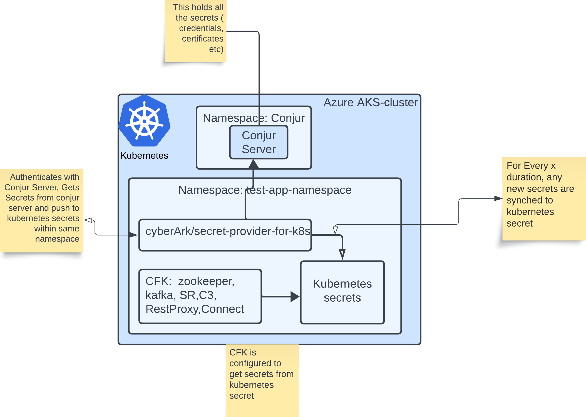

## POC details as follows.
-   setup Azure AKS cluster
-   setup a Conjur-OSS server running on "conjur" namesapce 
-   setup conjur-secret-provider as an application in a separate namespace ( "test-app-namespace"). conjur secret provider connect to conjur-server to get secrets and updates kubernetes secrets within same application namespace
-   setup cfk (cp-platform) in the same namespace as conjur-secret-provider. ("test-app-namesapce"). All the cp components on CFK is able to get the certificates/credentials  from kubernetes secrets ( zookeeper, kafka, SR, C3 , KafkaRestProxy, Connect, KSQLDB)

## Features:
-   kubernetes secrets are retrieved from Conjur secrets. The secret- Sync is set up as an application container(deployment) and not as a sideCar.
-   Auto Rotation of secrets :  Update a secret in Conjur,  Secret updates  are automatically  reflected in Kubernetes secrets.  CP Administrator determines when to roll the pods to reflect the latest changes .

## Key points about license:
1)  Apart from the standard CFK cluster deployemnt the only additional S/W compnent that i plugged in is  a  docker container "cyberark/secrets-provider-for-k8s:latest"
2)  My understanding is that there is no dependency on a licensed CyberARK secret Provider. ( no need to procure a new license , but not sure if there are any hidden lines ).

--------------------

### STEP 1: Demo SourceCode Setup
    git clone <this-repository>.
    CD into cfk-azure-cyberark-conjur-mtls

    export TUTORIAL_HOME=$PWD
---
### STEP 1.1 (Optional) Cleanup previous deployments ( if any )
    kubectl delete namespace test-app-namespace  conjur

    rm -rf $TUTORIAL_HOME/files-to-upload/cp-conjur-secrets/*
    rm -rf $TUTORIAL_HOME/helm/conjur-server-values.yaml
    rm -rf $TUTORIAL_HOME/assets/certs/component-certs/generated

---
### STEP 2: Prepare necessary certificates & secrets
Refer [prep-certs.md](./prep-certs.md)

---
### STEP 3: Update Tutorial_HOME
    cd ../../../
    export TUTORIAL_HOME=$PWD
---

### STEP 4:  Prepare files for upload operation to k8s cluster.
#### move necessary files to a common folder for upload - (cert files, secrets etc)
    cp $TUTORIAL_HOME/assets/certs/component-certs/generated/*.* $TUTORIAL_HOME/files-to-upload/cp-conjur-secrets/

    # move any credential secrets 
    cp $TUTORIAL_HOME/secrets/creds-control-center-users.txt $TUTORIAL_HOME/files-to-upload/cp-conjur-secrets/

    # remove unnecessary files
    rm -rf $TUTORIAL_HOME/files-to-upload/cp-conjur-secrets/*.csr

####  Prepare certs to Enable MTLS for conjur server 

      $TUTORIAL_HOME/scripts/create_mtls_certs.sh

      mv $TUTORIAL_HOME/ca.cert $TUTORIAL_HOME/files-to-upload/cp-conjur-secrets/
      mv $TUTORIAL_HOME/ca.key $TUTORIAL_HOME/files-to-upload/cp-conjur-secrets/

---
### STEP 5: Setup Conjur server
    CONJUR_NAMESPACE=conjur
    kubectl create namespace "$CONJUR_NAMESPACE"
    VERSION=2.0.7

Refer [setup-conjur-server.md](./setup-conjur-server.md)

---

### STEP 6:  Create configmap containing the mTLS cert & key
    kubectl create configmap cp-conjur-secrets -n $CONJUR_NAMESPACE --from-file $TUTORIAL_HOME/files-to-upload/cp-conjur-secrets/
    # Create a configmap containing all the policy files
    kubectl create configmap policies -n $CONJUR_NAMESPACE --from-file $TUTORIAL_HOME/policy

---

### STEP 7: Deploy a conjur-client CLI to manually upload certs to conjur-server

    kubectl create -f $TUTORIAL_HOME/deploy-scenarios/conjur-client.yaml -n $CONJUR_NAMESPACE

#### Enable shell access and connect using conjur-client
    kubectl exec -it -n $CONJUR_NAMESPACE conjur-client -- sh
    #with conjur-client creata file and load policy

#### Set certs and other config as Conjur secret variables
    export CONJUR_URL=https://conjur-oss
    export ACCOUNT=myorg
    conjur init -u $CONJUR_URL -a $ACCOUNT --self-signed

    conjur login 
    username: admin ..pwd copy from the previous (conjur-server-setup admin password)
    km3nnn1hvy8v1mamxjt3hge0013hcpqvqav56d41317zgw2m4sb43

    cd policy
    conjur policy load -f k8s-authenticator-webservice.yml -b root
    conjur policy load -f apps.yaml -b root
    conjur policy load -f app-secrets.yaml -b root

    cd ../cp-secrets
    conjur variable set -i conjur/authn-k8s/dev-cluster/ca/key -v "$(cat ca.key)"

    conjur variable set -i conjur/authn-k8s/dev-cluster/ca/cert -v "$(cat ca.cert)"

    #myorg:host:secrets-provider-app
    #apikey: 37dv9mtf2wb531ckb9p3223wqaf1qj7wjz38aebr11k33e4227ew1y3

    conjur variable set -i secrets/username -v myUser
    conjur variable set -i secrets/password -v MyP@ssw0rd!

    conjur variable set -i secrets/ca-certs/cacerts -v  "$(cat cacerts.pem)"
    conjur variable set -i secrets/creds/creds-control-center -v "$(cat creds-control-center-users.txt)"

    conjur variable set -i secrets/zookeeper/zookeeper-server -v  "$(cat zookeeper-server.pem)"
    conjur variable set -i secrets/zookeeper/zookeeper-server-key -v  "$(cat zookeeper-server-key.pem)"
    conjur variable set -i secrets/kafka/kafka-server -v  "$(cat kafka-server.pem)"
    conjur variable set -i secrets/kafka/kafka-server-key -v  "$(cat kafka-server-key.pem)"

    conjur variable set -i secrets/controlcenter/controlcenter-server -v  "$(cat controlcenter-server.pem)"
    conjur variable set -i secrets/controlcenter/controlcenter-server-key -v  "$(cat controlcenter-server-key.pem)"

    conjur variable set -i secrets/connect/connect-server -v  "$(cat connect-server.pem)"
    conjur variable set -i secrets/connect/connect-server-key -v  "$(cat connect-server-key.pem)"
    conjur variable set -i secrets/schemaregistry/schemaregistry-server -v  "$(cat schemaregistry-server.pem)"
    conjur variable set -i secrets/schemaregistry/schemaregistry-server-key -v  "$(cat schemaregistry-server-key.pem)"
    conjur variable set -i secrets/kafkarestproxy/kafkarestproxy-server -v  "$(cat kafkarestproxy-server.pem)"
    conjur variable set -i secrets/kafkarestproxy/kafkarestproxy-server-key -v  "$(cat kafkarestproxy-server-key.pem)"
    conjur variable set -i secrets/ksqldb/ksqldb-server -v  "$(cat ksqldb-server.pem)"
    conjur variable set -i secrets/ksqldb/ksqldb-server-key -v  "$(cat ksqldb-server-key.pem)"

---
#### Command to validate if all variables are added to conjur server
    conjur list
    exit ( off of shell)

---------------------------
### STEP 8:  Create Confluent platform namespace & deploy 

    kubectl create namespace test-app-namespace
    kubectl create serviceaccount test-app-sa -n test-app-namespace

---
#### copy SSL certs to the test-app-namespace
    kubectl get secret conjur-oss-conjur-ssl-cert --namespace=conjur -oyaml |\
    sed 's/namespace: conjur/namespace: test-app-namespace/g' |\
    kubectl apply -f -

--------------
#### create necessary secrets configurations
    CFLT_NS=test-app-namespace
    kubectl apply -f $TUTORIAL_HOME/secrets/cp-tls-secrets.yml  -n $CFLT_NS
    kubectl apply -f $TUTORIAL_HOME/secrets/cp-creds-secret.yml -n $CFLT_NS
    kubectl apply -f $TUTORIAL_HOME/secrets/db-credentials.yaml -n $CFLT_NS

---

#### Install CFLT operator
helm upgrade --install operator confluentinc/confluent-for-kubernetes --namespace $CFLT_NS

kubectl get pods --namespace $CFLT_NS

---
#### PUSH To SECRET with  Auto Rotation enabled 

        #### Add necessary role binding its the same for standalone and sidecar
        #create  a new rolebinding.

        kubectl apply -f $TUTORIAL_HOME/deploy-scenarios/job-to-secret-cflt-platform/rb-push-to-secret.yml -n test-app-namespace
        kubectl apply -f $TUTORIAL_HOME/deploy-scenarios/job-to-secret-cflt-platform/job-to-secrets.yaml -n test-app-namespace

        kubectl apply -f $TUTORIAL_HOME/deploy-scenarios/job-to-secret-cflt-platform/confluent-platform-mtls-acls.yaml --namespace $CFLT_NS
        
        ## Delete if needed
        kubectl delete -f $TUTORIAL_HOME/deploy-scenarios/job-to-secret-cflt-platform/job-to-secrets.yaml -n test-app-namespace

        kubectl delete cm  conjur-sidecar-cm -n   $CFLT_NS

---

#### Deploy CFLT platform
kubectl apply -f $TUTORIAL_HOME/deploy-scenarios/push-to-secret-cflt-platform/m/confluent-platform-mtls-acls.yaml --namespace $CFLT_NS

---
#### Portforward to access control panel
kubectl port-forward controlcenter-0 9021:9021 --namespace $CFLT_NS
https://localhost:9021

---

### TearDown
kubectl delete -f $TUTORIAL_HOME/deploy-scenarios/job-to-secret-cflt-platform/confluent-platform-mtls-acls.yaml --namespace $CFLT_NS
kubectl delete secret \
tls-zookeeper tls-kafka  tls-controlcenter tls-schemaregistry tls-connect tls-ksqldb credential  tls-kafkarestproxy \
-n $CFLT_NS

helm delete operator --namespace $CFLT_NS

---
##### IMPORTANT NOTES:

    Some notes about the different configuration methods: For a setting that can be configured either by Pod Annotation or by environment variable, a Pod Annotation configuration takes precedence over the corresponding environment variable configuration.
    If you are using the Secrets Provider in Push-to-File mode, then the Secrets Provider must be configured via Pod Annotations.
    If you are using the Secrets Provider in Kubernetes Secrets mode, it is recommended that you use environment variable settings to configure the Secrets Provider.
---
### References:

- https://www.youtube.com/watch?v=eK8CFwlL5XU
- https://docs.cyberark.com/AAM-DAP/13.0/en/Content/Resources/_TopNav/cc_Home.htm
- https://blog.sighup.io/secrets-manager-insight-about-cyberark-conjur/
- https://www.infracloud.io/blogs/securing-kubernetes-secrets-conjur/#define-conjur-policies
- https://github.com/samkulkarni20/conjur-k8s-integration
- https://play.instruqt.com/embed/cyberark/tracks/secure-kubernetes-secrets-v2/challenges/setup-conjur/assignment
- https://docs.cyberark.com/AAM-DAP/12.4/en/Content/Operations/Services/azure_authn.htm?tocpath=Integrations%7C_____9
- https://external-secrets.io/latest/introduction/getting-started/
- https://github.com/external-secrets/external-secrets/issues/478#issuecomment-964413129
- https://itnext.io/exploring-kubernetes-secret-management-solutions-a-comparative-of-external-secret-operator-eso-4d6cf2f2a630

- https://www.youtube.com/watch?v=eK8CFwlL5XU
- https://github.com/rajnishgargcloudrepository/conjur-aks
- https://www.cncf.io/online-programs/kubernetes-secrets-management-build-secure-apps-faster-without-secrets/
imp:webinar spiffee 
- https://docs.conjur.org/Latest/en/Content/Integrations/k8s-ocp/k8s-set-up-apps.htm
- https://github.com/conjurdemos/kubernetes-conjur-demo
- https://github.com/huydd79/conjur-k8s-lab

- https://github.com/salesforce/generic-sidecar-injector

- https://developer.cyberark.com/blog/understanding-conjur-policy/

